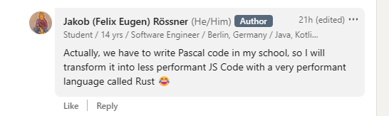

# Pascal to JS Compiler
This is a simple Pascal to JavaScript compiler. It is written in Rust without using an external lexer or parser generator _(I don't understand them anyways)_.

## Goal

## Usage

1. Put your individual Pascal files in a folder called `pascal-input`.
2. Run the compiler using `cargo run` in the root directory of the project.
3. The generated JavaScript files will be in a folder called `js-output`.

## Supported APIs

- Writeln