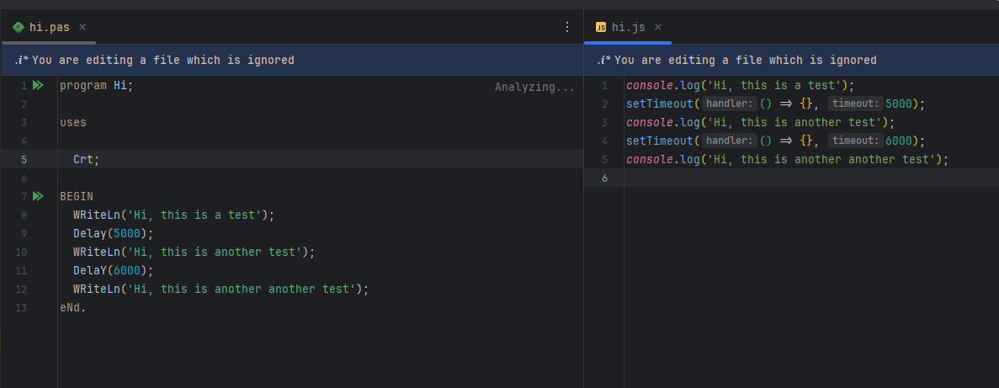
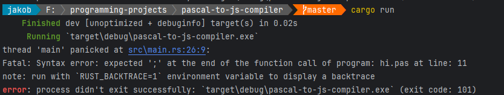

# Pascal to JS Compiler

This is a simple Pascal to JavaScript compiler. It is written in Rust without using an external lexer or parser
generator _(I don't understand them anyway)_.

## Goal

## Usage

1. Put your individual Pascal files in a folder called `pascal-input`.
2. Run the compiler using `cargo run` in the root directory of the project.
3. The generated JavaScript files will be in a folder called `js-output`.

## Example

  
Code compiled from Pascal to JS:  

  
Compiler error for a missing semicolon:  

## Supported Features

- [x] Variables

### Standard Pascal APIs

- Writeln

### Library APIs

> [!NOTE]  
> These get redundant if this compiler gets support for compiling libraries.

**CRT**

- Delay